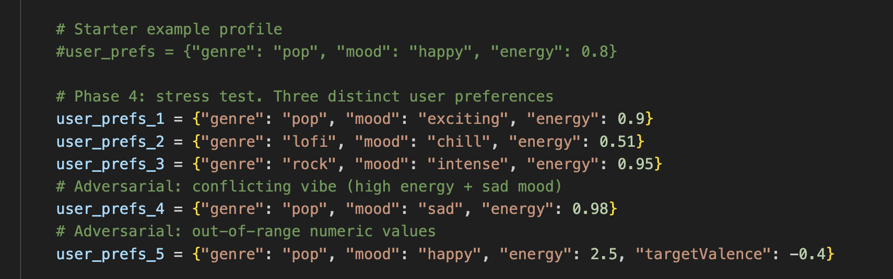
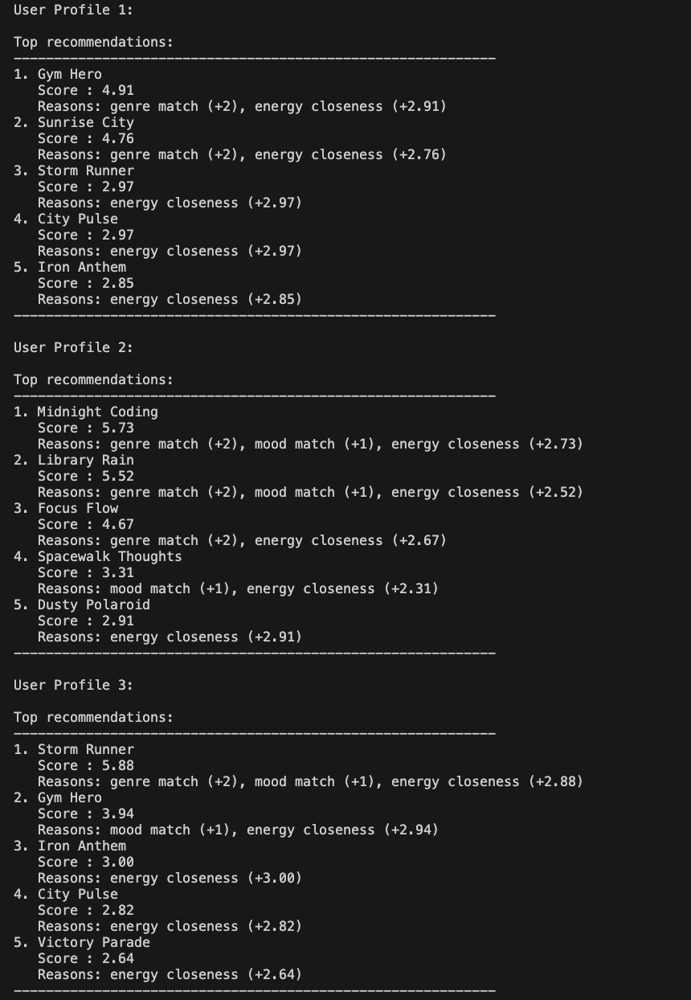
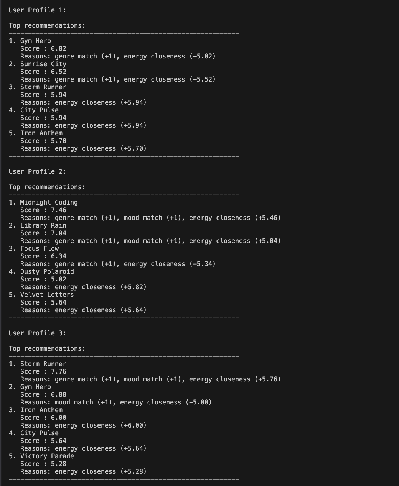
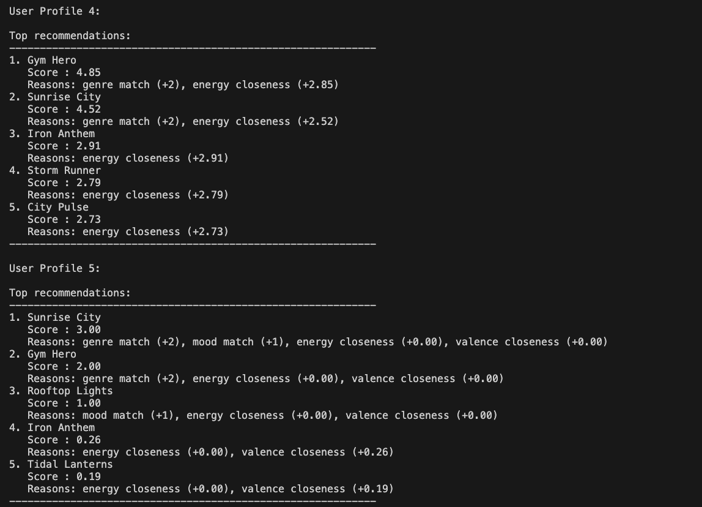
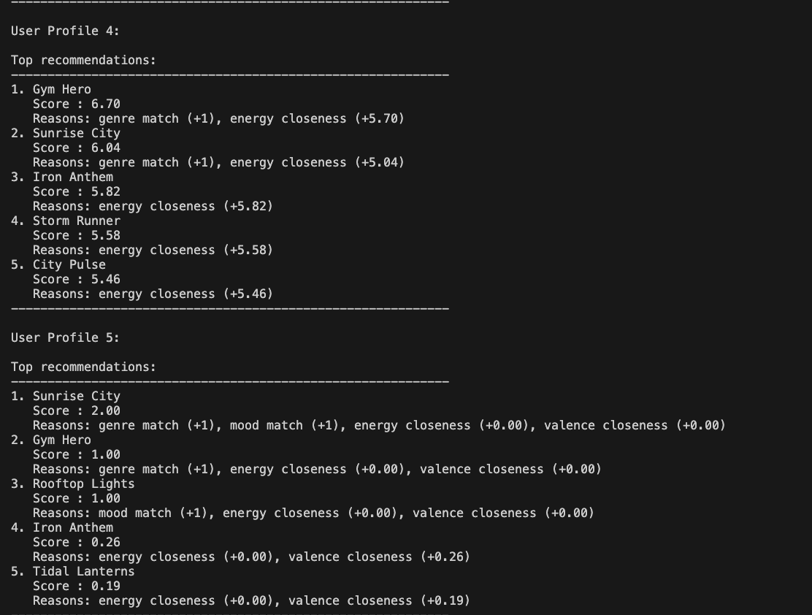

# 🎧 Model Card: Music Recommender Simulation

## 1. Model Name  

Welcome to **<u>Magic Jukebox</u>**! 

---

## 2. Intended Use  

Describe what your recommender is designed to do and who it is for. 

Prompts:  

- What kind of recommendations does it generate  
    It recommends the user songs ( k number of songs) based on their profile. It uses genre, artist, mood, acoustic preference, and many more. 
- What assumptions does it make about the user  
   The asumptions it makes about the user is they will continue to listen to songs based on their current profile, and that we can predict the songs they might like based on relatively simple calculations. 
- Is this for real users or classroom exploration  
   It's mostly for classroom exploration and understanding since it has only been testes with a small dataset and also without a neat UI for the users to use. But I think if this could be expanded, it could definitely work in a bigger context with real users!!

---

## 3. How the Model Works  

Explain your scoring approach in simple language.  

Prompts:  

- What features of each song are used (genre, energy, mood, etc.)  
- What user preferences are considered  
- How does the model turn those into a score  
- What changes did you make from the starter logic  

Avoid code here. Pretend you are explaining the idea to a friend who does not program.

Answer: The features used are genre, mood, energy, valence(how positive or cheerful a song feels), acoustic-ness, and preferred artist. Some features like genre and mood matter more than the others, since these allow for more exploration and consistency accross days. The others are more complimentary, and give additional information, but do not overpower genre importance so that we can avoid covering the same songs only. Scores are calculated based on how well a song matches the user's profile. Genre and mood are almost matched exactly, and depending on if they are or not, points are added to the total score. The number of points added depends on the weight, where some features matter more than the others and therefore have a higher weight. For the numeric components like energy, higher points mean a higher closeness to the target energy value from the user's preference. From the starter logic, I added a lot of extra components like valency, acousticness and preferred artist. I also slight incresed the weight of mood, but still kept it less that genre, because mood can change by session or day/couple of days, but genre might be more consistent. 

---

## 4. Data  

Describe the dataset the model uses.  

Prompts:  

- How many songs are in the catalog  
- What genres or moods are represented  
- Did you add or remove data  
- Are there parts of musical taste missing in the dataset  

There are eight songs in the catalogue. I asked copilot to generate some more data with varying genres and other features. The genres are a good mix (rock, pop, euphoric, folk, orchestral) and so are the moods(happy, chill, triumphant, moody, serene). I've used most of these features in the scoring guide as well. 
---

## 5. Strengths  

Where does your system seem to work well  

Prompts:  

- User types for which it gives reasonable results  
- Any patterns you think your scoring captures correctly  
- Cases where the recommendations matched your intuition  

It seems to give better results for when most of the user's preference match well and are easy to find in a dataset, like pop with happy or uplifting tone, or metal with high intensity and energy. It seems to catch the patterns that match a correlation between genre and energy, like chill with lofi, etc. For example, user 4 in the test liked high energy sad pop. There wasn't an exact match ,but it picked a song that matched most of the high importance features: Gym Hero, intense pop with really high energy. 
---

## 6. Limitations and Bias 

Where the system struggles or behaves unfairly. 

Prompts:  

- Features it does not consider  
- Genres or moods that are underrepresented  
- Cases where the system overfits to one preference  
- Ways the scoring might unintentionally favor some users  

Genre is still highly preferred, and the model might not be able to recommend outside the genre easily. For example, I like listening to a lot of different genres, and the genre that is picked as my preference in my user profile might not make up the vast majority of songs I listen to. And if the recommendation system only gave me recs for my top genre, I might feel like it's repitive. 
Some other points: 
    - "Chill" vs "Relaxed" could be treated differently because of matching, but should be treated more similarly than most others. 
    - The size of the dataset is still kind of small, so it doesn't contain enough variance to be properly tested on. 
    - New users might not be able to get a full recommendation. Perhaps this is where we could use context information like location, age, language, time of day. If in the implemented UI, the user selected specific preferences similar to the ones used in this model, this model might still work well in giving recommendations. 

A weakness Copilot observed was once a profile matches a specific style, the top results keep returning very similar songs, so discovery drops and recommendations feel repetitive. This happens because the system always picks the highest raw scores and does not add a diversity step.

Could solve some of this by: softer similarity searching/finding instead of matches, as well as fine-tuning weights. Increasing dataset size, and testing distribution of top songs to check if any genres/moods are skewing towards any direction. 

---

## 7. Evaluation  

How you checked whether the recommender behaved as expected. 

Prompts:  

- Which user profiles you tested  
- What you looked for in the recommendations  
- What surprised you  
- Any simple tests or comparisons you ran  

No need for numeric metrics unless you created some.

The first check was loading the dataset, and it loaded 18 songs, which was correct. 
The second check was with the user profiles. Below are the profiles that were tested. 

The test was doubling the importance of energy and half the importance of genre.
There are total 5 users. 
Below are the comparison for users 1-3

After change:

User1: The songs chosen remained the same, but the score for the top songs increased in the change. This user wanted exciting high-energy pop songs, and this matches well with the songs chosen. The top song, Gym hero's score increased, because the high energy of the song was already high to begin with so it matched the desired energy, and because of the increased weight, the score increased. 

User2: This user liked chill lofi music mid-energy. The rankings for #4-#5 song changed. "Dusty Polaroid" climbed up one spot because of a higher weight for enrgy match, which added more points. 

User3: Likes intense high-energy rock. Rankings stayed same, but score increased because of weight change. 

Below are the comparison for users 4-5

After change: 

User4: Likes high energy sad-pop. The matchup between energy and mood and genre was interesting in this user profile. The rankings stayed the same, score increased. The model picked Gym Hero, intense high energy pop as the top song. 

User5: Out of bounds example: Happy pop, with energy 2.5 and valence below zero, which kind of condradict each other as well. Rankings were the exact same, but this time the score actually decreased. Perhaps the top matches Sunrise City, Gym Hero, and Rooftop Lights were impacted more by the others. However, the score also isn't as high as the recommendations for the previous users. This could be somewhere the app could improve in the future. 

---

## 8. Future Work  

Ideas for how you would improve the model next.  

Prompts:  

- Additional features or preferences  
- Better ways to explain recommendations  
- Improving diversity among the top results  
- Handling more complex user tastes  

Genre is still highly preferred, and the model might not be able to recommend outside the genre easily. For example, I like listening to a lot of different genres, and the genre that is picked as my preference in my user profile might not make up the vast majority of songs I listen to. And if the recommendation system only gave me recs for my top genre, I might feel like it's repititive. 

A weakness Copilot observed was once a profile matches a specific style, the top results keep returning very similar songs, so discovery drops and recommendations feel repetitive. This happens because the system always picks the highest raw scores and does not add a diversity step.

Could solve some of this by: softer similarity searching/finding instead of matches, as well as fine-tuning weights. Increasing dataset size, and testing distribution of top songs to check if any genres/moods are skewing towards any direction. Also, user5 test showed how complex user tastes are still a little hard for the current model, so it could be improved in the future. Maybe bringing in 
collaborative filtering could help in this!
---

## 9. Personal Reflection  

A few sentences about your experience.  

Prompts:  

- What you learned about recommender systems  
- Something unexpected or interesting you discovered  
- How this changed the way you think about music recommendation apps  

This was a really interesting project! It was a little confusing to me before how Spotify and Youtube were converting matches into scores, so it was nice to see a starter version of it. Something unexpected was acousticness and other components/features I didn't think about that Copilot and the README+datset suggested. The weights and importance of them was really interesting and valuable to learn about as well. Weights, even small tweaks, can change a lot of things. Thinking about this scoring guide really changes the way I view the music recommendation apps, because I started thinking about how things like adding a song, how long I wait before skip can be used to keep changing the user preferences. Each time I add a song to my liked list or make a new playlist, I'll probably think about how it changes what music the app recommends to me next time. 

This was a really nice assignment, it was very enjoyable too. Thank you! 